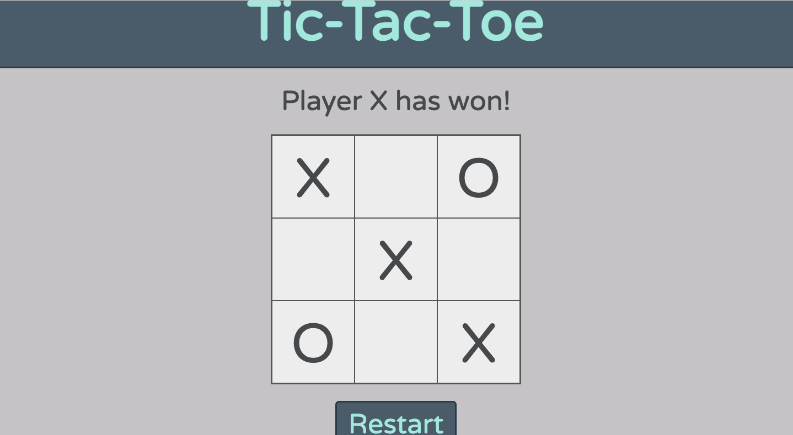

# tic-tac-toe

> This is a Tic Tac Toe game you can play in your browser!
In this JavaScript project i used the Objects and objects construtors, factory functions and module pattern to build this project.
Choose X or O and let the game begin! 

## Built with

- HTML
- CSS
- JavaScript

## Author

**Neto Daniel ZINGA**
- Github: [@dannyclever](https://github.com/dannyclever)
- Email: [Neto Danile Zinga](danielnzinga5@gmail.com)

[Version live](https://dannyclever.github.io/tic-tac-toe/)